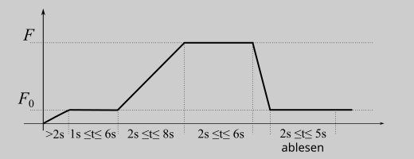
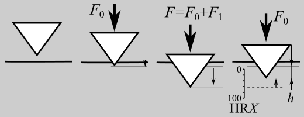
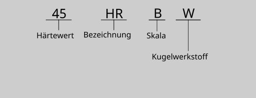

# Rockwell

(ueber)=
## Übersicht Prüfung

| [Härteprüfung nach Rockwell](https://de.wikipedia.org/wiki/H%C3%A4rte#Rockwell_(HR)) |  DIN EN ISO 6508-1:2024-04  |
| ----------- | ----------- |
| [Prüfkörper](probehr) | Glatte ebene Prüffläche, Mindestdicke: a) Diamateindringkörper $10\cdot {h}$, b) Eindringkugel $15\cdot {h}$; insbesondere darf auch die Auflage der Probe keine unebenheiten aufweisen
| Eindringkörper | Abhängig von der Skala: Rockwell B: Kugel aus Wolframcrabid (Hartmetall, früher auch gehärteter Stahl) $D=1,5875 \text{mm} $; Rockwell C: Diamatkegel mit einem Kelgelwinkel von $120°$ und einem Krümmungsradius an der Spitze von $0,2\text{mm}$ |
| [Prüfkraft](pkhr) | Skalenabhänging; zu unterscheiden sind Prüfvorkraft $F_0$ und Prüfgesamtkraft $F$; Rockwell C: $F=1,471\text{kN}$; Rockwell B $F=980,7\text{N}$ |
| Position Eindruck | (fast) frei wählbar; Rand und Lochabstände beachten (vgl. DIN EN ISO 6508-1 Abschn. 7.13) |
| [Ablauf](ablhr) | 1. Belasten mit $F_0$ in $t \geq 2\text{s}$ und halten für $3^{+3}_{-2}\text{s}$  ; 2. Erhöhen der Kraft auf $F$ in $2\text{s}\leq{} t \leq{} 8 \text{s}$ und halten für $5^{+1}_{-3}\text{s}$ ; 4. Entlasten auf $F_0$ und ablesen des Wertes innerhalb von $4^{+1}_{-3}\text{s}$ |
| [Ausmessen des Eindrucks](eindrhr)  | Eindringtiefe $h$ unter Prüfvorkraft | 
| [Berechnung des Härtewertes](ber) | Härte wird Skalenabhängig aus der der Eindringtiefe berechnet; i.d.R. wird der Härtewert dirket and er Prüfmaschine angezeigt |
| [Angabe des Wertes](werthr) | *Zahlenwert* **HR***Skala* *soweit notwendig: Bezeichnung des Typs der verwendeten Eindringkugel (W: Wolframcarbit, S: Stahl[^AnmStahl])*, z.B. 52,3 HRC, 23 HRBW | 

[^AnmStahl]: In der aktuellen Fassung der Norm ist nur der Werkstoff Wolframcarbit zulässig, damit ist die Unterscheidung nicht mehr notwendig. Dennoch bleibt das *W* bei der Angabe erhalten. Im Labor wird die Prüfung i.d.R. normabweichend mit einer Stahlkugel gemacht. Hier ist dann natürlich das *S* einzusetzten. 

(probehr)=
## Prüfkörper

Die Prüfung muss an einer glatten une ebenen Oberflächer vorgenommen werden. 
Die Dicke der Probe muss mindestens das 8-Fache bzw. das 15-Fache der Eindringtiefe $h$ betragen: 

$\textit{Mindestdicke Diamantkegel}=10\cdot h$
$\textit{Mindestdicke Kugel}=15\cdot h$

Besondes Wichtig bei diesem Verfahren ist, dass es aufgrund der typischen Bauweise der Prüfmaschinen auf der Probenauflagefläche keine palstischen Verformgungen geben darf, da diese dann als Eindringtiefe mit gemessen werden.

Kann der Härtewert geshätzt werden, kann die Eindruckdiagonale $d$ aus der Gelichung für die Härteberechnung zurückgerechnet und so die Mndestdicke abgeschätzt werden.s

[Übersicht](ueber) 

(pkhr)=
## Prüfkräfte

Die Prüfkräfte sind für die jeweilige Rockwellskala festgelegt:

|Skala| Eindringkörper |Prüfvorkraft $F_0$| Prüfgesamtkraft $F$ |
| ----------- | ----------- |----------- |----------- |
|B|Kugel $D=1,5875 \text{mm}$ |98,07 N|588,4 N|
|C|Diamantkegel |98,07 N| 1,471 kN|

[Übersicht](ueber) 

(ablhr)=
## Ablauf

Der Prüfablauf besteht aus dem Aufbringen der Prüfvorkraft $F_0$, dem "Nullen" der Tiefenmesusng, dem Erhöhen auf der Kraft auf die Prüfkraft $F$, dem Entlasten auf die Prüfvorkraft $F_0$ und dem Ausmessen der bleibenden Eindringtiefe $h$.

(eindrhr)=
## Ausmessen des Eindrucks
Zur Bewertung des plastischen Eindrucks wird die bleibender Eindrucktiefe $h$ unter der weiterhin wirkenden Vorkraft $F_0$ gemessen. In der Regel wird nicht die bleibende Eindringtiefe in mm gemessen, sondernd direkt mit einem (sozusagen inersen) Tiefenmaß, dass der Härteskala entspricht.

[Übersicht](ueber) 

(berhr)=
## Berechnung des Härtewertes

Aus der Messgröße des Verfahrens, der bleibenden Eindringtiefe $h$ unter Prüfvorkraft wird der Härtewert berechnet. Dabei wird je Skala ein Bereich für die Eindringtiefe festgelegt und dieser Bereich in eine sinnvolle Skala eingeteilt (HRC 100 Skalenteile, HRBW 130 Skalenteile):

|Skala| Berechnung mit $h$ in mm | Gültigkeitsbereich | Eindringtiefen im Gültigkeitsbereich|
| ----------- | ----------- |----------- | ----------- |
|B| $\text{HRBW}=130-h/0,002$ | 10 HRBW bis 100 HRBW | $0,24\text{mm}$ bis $0,06\text{mm}$ |
|C| $\text{HRC}=100-h/0,002$ | 20 HRBW bis 70 HRBW |$0,16\text{mm}$ bis $0,06\text{mm}$ |

In der Regel erübrigt sich die Berechnung, da die Eindringtiefe direkt als Härtewert "gemessen" und der Wert direkt von der Prüfmaschine ausgegeben wird. Damit wird die bleibende Eindringtiefe $h$ nicht angegeben und daraus explizit der Härtewerdt berechnet. Dieses Verfahren war daher schon zu "nichtdigitalen" Zeiten sehr gut automatisierbar. 

[Übersicht](ueber) 

(werthr)=
## Angabe des Härtewertes

Da die Härte ein relative Maß ist, die Maßzahlen unterschiedlicher Skalen nicht direkt vergleichbar sind und die Härtewerte von den Prüfbedingungen abhängen, ist eine korrekte Angabe des Härtewertes nach der jeweiligen Prüfnorm essentiell. Ansonsten ist der Zahlenwert nutzlos!

Der Prüfbericht muss in Anlehnung an DIN EN ISO 6508-1, Absch. 10 folgende Angaben enthalten:

a) Normenverweis

b) Probenbezeichnung zur eindeutigen Zuordnung

c) Prüftemperatur

d) Prüfergebnis

e) alle optionalen oder nicht vorgegebenen Vorgänge

f) Vorkommnisse, die möglicherweise einen Einfluss auf das Prüfergebnis haben könnten

g) ggf. die tatsächliche Einwirkdauer der Prüfkraft, wenn von der Normvorgabe abweichend

h) Prüfdatum

i) ggf. Grundlagen für die Umwertung und das Umwerteverfahren

[Übersicht](ueber) 

