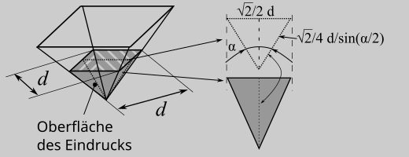
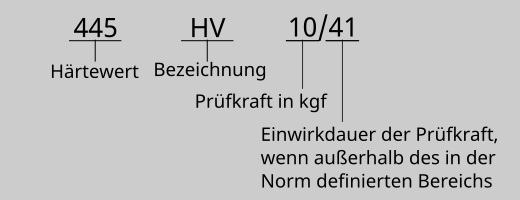

# Vickers

(ueber)=
## Übersicht Prüfung

| [Härteprüfung nach Vickers](https://de.wikipedia.org/wiki/H%C3%A4rte#Vickers_(HV)) | DIN EN ISO 6507-1:2018-07 |
| ----------- | ----------- |
| [Prüfkörper](probehv) | Glatte ebene Prüffläche, Mindestdicke $1,5\cdot\textit{Diagonalenlänge}$
| Eindringkörper (fix) | vierseitige Pyramide (quadratische Grundfläche, Spitzenwinkel zwischen den Flanken 136°, Spitze nicht abgerundet) aus Diamant |
| [Prüfkraft](pkhv) | Je nach Anwendung zwischen 0,09807 N bis 980,7N, (fast) frei wählbar |
| Position Eindruck | (fast) frei wählbar; Rand und Lochabstände beachten (vgl. DIN EN ISO 6507-1 Abschn. 8.8) |
| Ablauf | 1. belasten in $7^{+1}_{-5}$ s, 2. halten (Einwirkdauer) $14^{+1}_{-4}$ s (bei abweichender Zeit mit anzugeben), 3. komplett entlasten |
| [Ausmessen des Eindrucks](eindrhv)  | Eindruckdiagonalen $d_1$ und $d_2$| 
| [Berechnung des Härtewertes](berhv) | Vickers-Härte $\approx 0,1891\cdot \frac{F}{d^2}$, $F$ in N mit $d=\frac{d_1+d_2}{2}$ in mm |
| [Angabe des Wertes](werthv) | *Zahlenwert* **HV** *Prüfkraft in kgf* **/** *ggf. Haltezeit in s*, z.B. 233 HV 30, 334 HV 10/30| 

(probehv)=
## Prüfkörper

Die Prüfung muss an einer glatten une ebenen Oberflächer vorgenommen werden (die Probe muss eine Oberflächenbearbeitung aufweisen). 
Die Dicke der Probe muss mindestens das 1,5-Fache der Eindruckdiagonallenlänge betragen. Lässt sich die Härte einschätzen, so ergibt sich aus der Gleichung zur Berechnung des Härtewertes die Mindestdicke über

$\textit{Mindestdicke}=1,5\cdot d=1,5\sqrt{(0,1891\cdot F/\textit{"HV"}}\cdot 1\text{mm}/\sqrt{1\text{N}})$

bzw. (bei einer vorhandenen Probe) die maximal zu verwendende Prüfkraft $F_{max}$ zu

$F_{max}=\textit{"HV"}\cdot d^{2} / 0,1891 = \textit{"HV"}\cdot (\textit{Probendicke}/1,5)^{2} / 0,1891 \cdot 1\text{N}/(1\text{mm}^2)$

Sind die Oberflächen gekrümmt (z.B. bei Wellen oder Achsen) ist Abschn. 7.4 der DIN EN ISO 6507-1 zu beachten. 

[Übersicht](ueber) 

(pkhv)=
## Prüfkräfte

Da sich mit dem Vickers-Diamanten als Eindringkörper im Prinzip immer auswertbare Eindrücke erzeugen lassen, gibt es keine Normvorgaben für die Wahl der Prüfkräfte. Damit ist sowohl die "normale" Härte zu prüfen, als auch die Mikrostruktur (vgl. Bereiche der nachfolgenden Tabelle). Für eine gute Auswertung sollten möglichst große Eindrücke erzeugt werden (die natürlich noch durhc die Optik auswertbar sein müssen). Damit sollten tendentiell bei härteren Werkstoffen höhere Prüfkräfte verwendet werden. Ggf. ergibt sich aus der [Dicke des Prüfkörpers](probe) eine Beschränkung der Prüfkraft um nicht zu große Eindrücke zu erhalten. 
Wird die Prüfung im Rahmen einer Normprüfung oder anderen Vorgaben durchgeführt, sind hier meist Prüfkräfte definiert. Dies ist dann natürlich zu bechten. 

| Bereich | Prüfkraft in N | Benennung Tab.1 DIN EN ISO 6507-1 |
| ----------- | ----------- | ----------- |
| konventionell | $F\geq 49,03$  ($\geq$HV 5) | Härteprüfung nach Vickers |
| Kleinkraft | $1,961\leq F < 49,03$ (HV 0,2 bis $<$ HV 5) | Härteprüfung nach Vickers im Kleinkraftbereich |
| Mikrohärte | $9,807\cdot10^{-3}\leq F < 1,961 $ (HV 0,001 bis $<$ HV 0,2) | Vickers-Mikrohärteprüfung |

[Übersicht](ueber) 

(eindrhv)=
## Ausmessen des Eindrucks
Zur Bewertung des plastischen Eindrucks werden die Eindruckdiagonalen gemessen. Damit sind die Diagonalen die eigendtlichen Messgrößen. Weichen die beiden gemessenen Diagonalenwerte mehr als 5% voneinander ab, so ist das im Prüfbericht zu vermerken!

[Übersicht](ueber) 

(berhv)=
## Berechnung des Härtewertes

der Härtewert ergibt sich aus der Prüfkraft $F$ und der Oberfläche des Eindrucks $A_{D}$. Die Berechnung der Oberfläche des Eindrucks erfolgt über die Geometire des Eindringkörpers(hier die Diamantpyramide mit quadratischer Grundfläche und einem Spitzenwinkel von $\alpha=136°$) und die mittlere gemessene Eindruchdiagonale

$d=\frac{d_1+d_2}{2}$

Der berechnete Wert wird der Härteskala zugeordnet und ist ein reiner Zahlenwert ohne Dimension. Da die Vickers-Härteskala bereits zu beginn des 20. Jahrhunderts entwickelt wurde, hat ist mit den alten Härtewerten die alte Krafteinheit $kp=kgf$ (*Kilopond*) verbunden. Die Umrechnung erfolgt über die Erdbeschleunigung:

$[F]=1 \text{N} = g_{n} \cdot 1 \text{kp}$ mit $g_{n}= 9,80665 \frac{\text{m}}{\text{s}^2}$

Damit ergibt sich für den Härtewert:

$ \textit{Vickers-Härtewert} = \frac{1}{g_n} \cdot \frac{F}{A_D} = \frac{1}{g_n} \cdot \frac{2\cdot F}{d^2/sin(\frac{\alpha}{2})} $

bzw. mit den Werten für $g_{n}$ und $\alpha = 136°$

$ \textit{Vickers-Härtewert} \approx 0,1891\cdot \frac{F}{d^2} $ mit $F$ in N mit $d$ in mm

[Übersicht](ueber) 

(werthv)=
## Angabe des Härtewertes

Da die Härte ein relative Maß ist, die Maßzahlen unterschiedlicher Skalen nicht direkt vergleichbar sind und die Härtewerte von den Prüfbedingungen abhängen, ist eine korrekte Angabe des Härtewertes nach der jeweiligen Prüfnorm essentiell. Ansonsten ist der Zahlenwert nutzlos!

Der Prüfbericht muss in Anlehnung an DIN EN ISO 6507-1:2018, Absch. 10 folgende Angaben enthalten:

a) Normenverweis

b) Prbenbezeichnung zur eindeutigen Zuordnung

c) Prüfdatum

d) Prüfergebnis

e) alle wesentlichen Randbedingunen der Prüfung, die nicht in der Norm festgelegt sind

f) Ereignisse oder Bedinugnen die ggf. das Prüfergebnis beeinträchtigen können

g) die Prüftemperatur

h) ggf. Grundlage und Verfahren der Umwertung

[Übersicht](ueber) 

