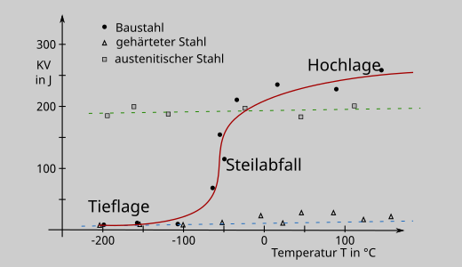

# Auswertung

## Bewertung des Gleit-/ Sprödbruchanteils

Der Gleitbruchanteil (= 1-Sprödbruchanteil) (Anteil der zähen oder duktilen Bruchstruktur auf der Bruchfläche) lässt isch über die DIN EN ISO 148-1 Anahng C bewerten. Hierfür sind die unterschiedlichen Bruchstrukturen auf der Bruchfläche zu identifizieren: 

- die Gleitbruchbereiche sind tendentiell matt und zeigen Verformungen aus der Ebene heraus, 
- die Spröd- oder Spaltbruchanteile sind eher glänzende und verlaufen senkrecht zur Hauptbeanspruchung. 


## Darstellung als "Verbrauchte Schlagenergie"-Temperatur-Kurve

Wir die verbrauchte Schlagarbeit mit unterschiedlichen Proben bei verschiedenen Temperaturen ermittelt lassen sich die Ergebnisse als "Verbrauchte Schlagenergie"-Temperatur-Kurve darstellen.



Werkstoffabhängig lassen sich unterschiedliche Charakteristiken festellen:

- spröde Werkstoffe (z.B. gehärtete Stähle) zeigen eine geringe Schlagarbeit, der Bruch ist spröde
- Baustähle (oder allg. Metalle mit krz-Kristallgitter) zeigen einen Übergang von zähem zu sprödem Bruchverhalten; im Bereich des Zäh- oder Gleitbruchs ergeben sich hohe Werte für die verbrauchte Schlagarbeit die *Hochlage*; mit sinkender Teemperatur kommt es innerhalb eines kleinen Temperaturbereichs zum *Steilabfall*, dem Wechsel von Zäh- zum Sprödbruch; der Bereich des Sprödbruchs wird als *Tieflage* bezeichnet 
- austenitische Stähle (oder Metalle mit krz-Kristallgitter) zeigen keinen Steilabfall und versagen auch bei tiefen Temperaturen noch als Zäh- bzw. Gleitbruch


## Ermittlung der Übergangstemperatur

Die Übergangstemperatur $T_t$ ist die Temperatur, die den Temperaturbereich des Steilabfalls kennzeichnet. Sie kann auf unterschiedliche Arten ermittelt werden (vgl. DIN EN ISO 148-1 Anhang D.2). Im folgenden werden nur zwei arten genannt.

```{note}
Die nach unterschiedlichen Verfahren ermittelten Übergangstemperaturen sind nicht direkt miteinander vergleichbar. Das Verfahren muss daher vorgegeben werden (z.B. in der jeweiligen Produktnorm)!
```

### Übergangstemperatur $T_{t27J}$ bei 27J verbrauchter Schlagenergie

Als Übergangstemperatur wird die Temperatur defieirt, bei der die Proben eine verbrauchte Schalgarbeit von KV=27J aufweisen:


### Übergangstemperatur $T_{t50\%US}$ bei 50% der verbrauchten Schlagenergie der Hochlage

Als Übergangstemperatur wird die Temperatur definiert, bei der die Proben eine verbrauchte Schalgarbeit von 50% der Schlagenergie der Hochlage aufweisen:


