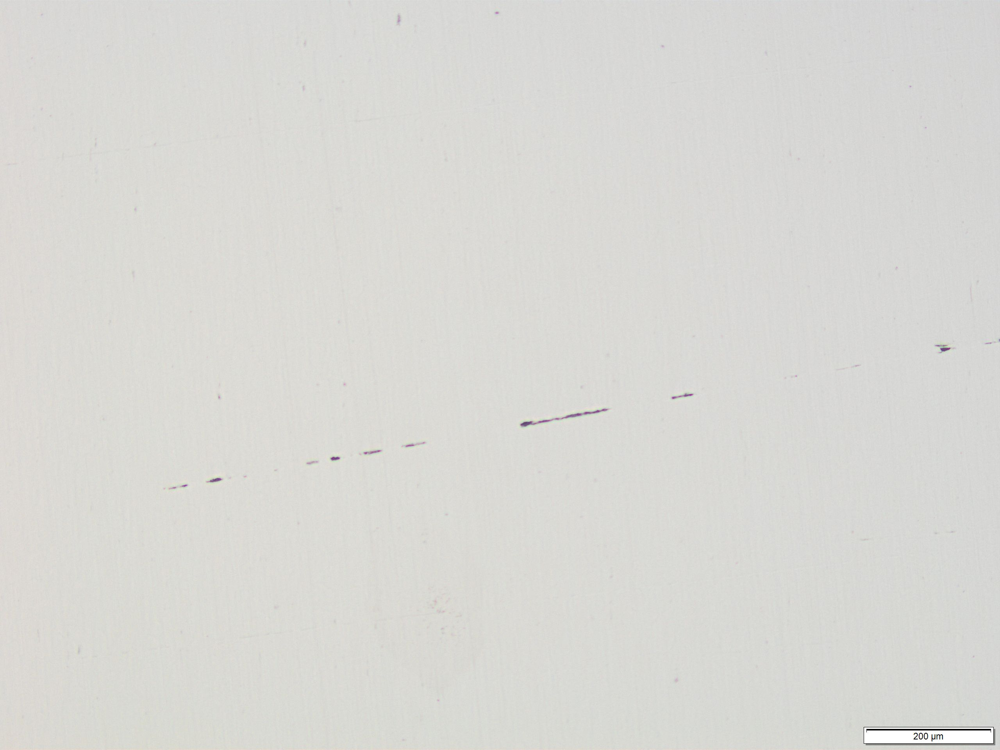
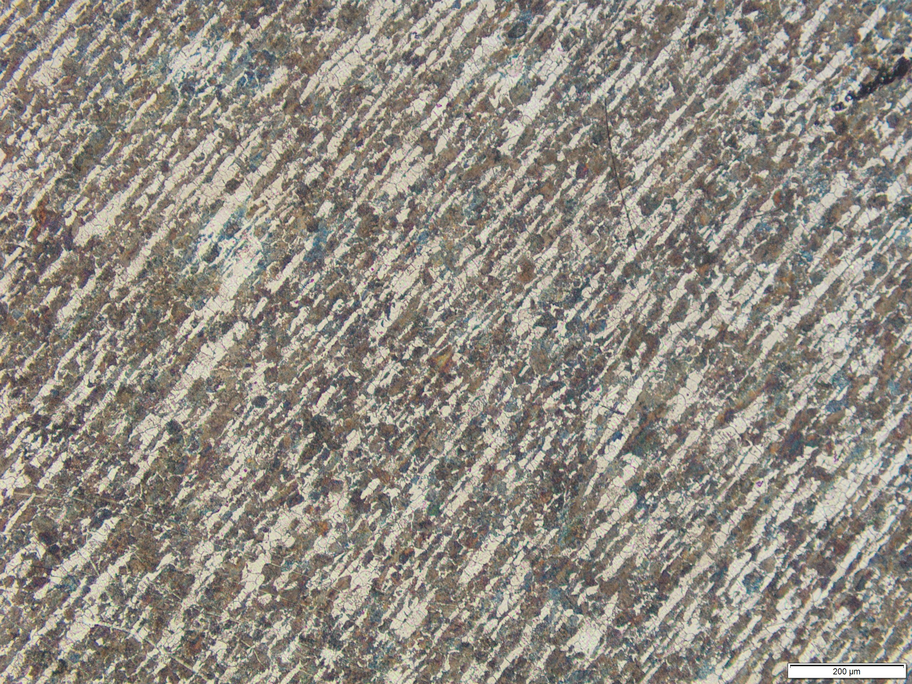
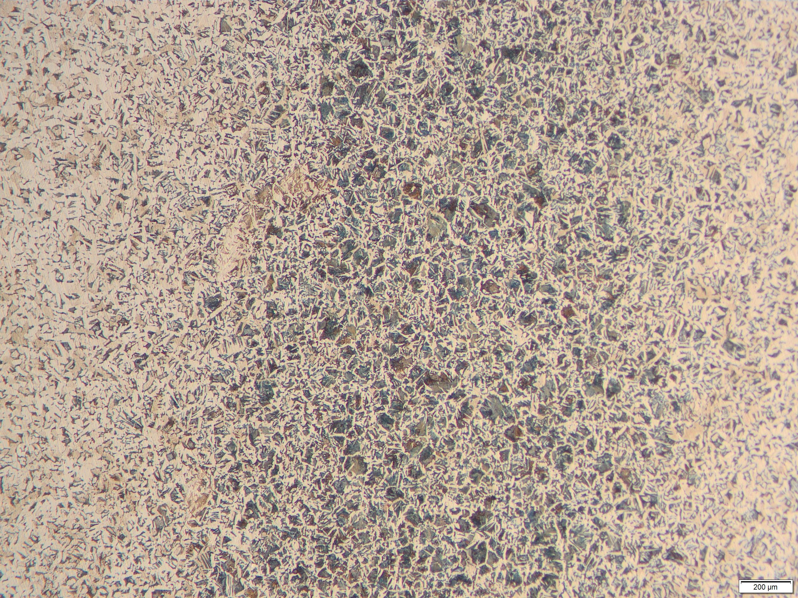
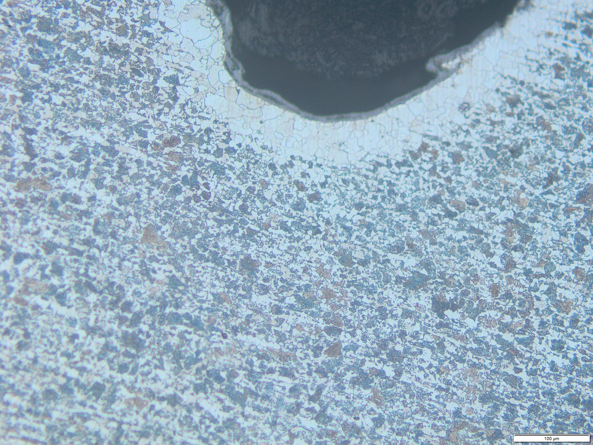
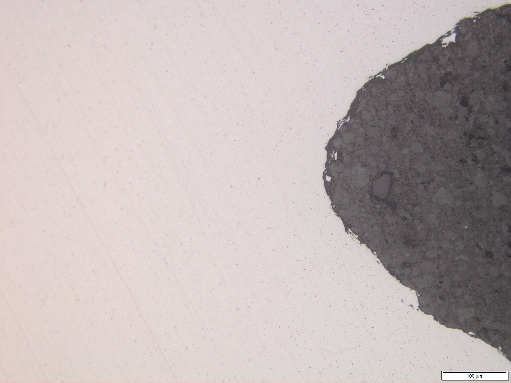
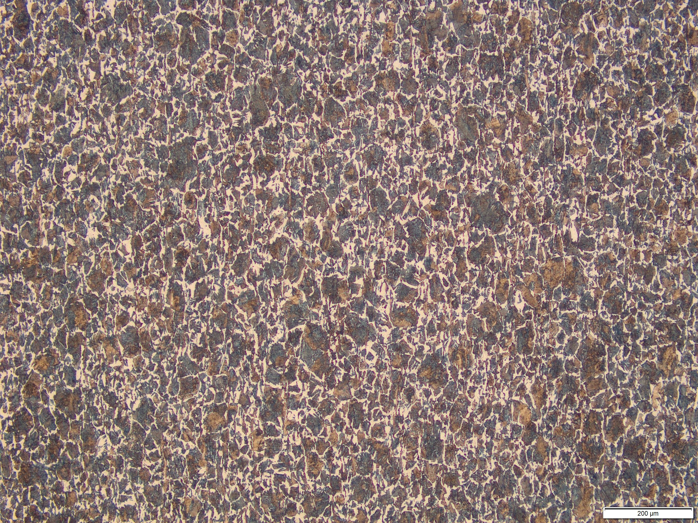
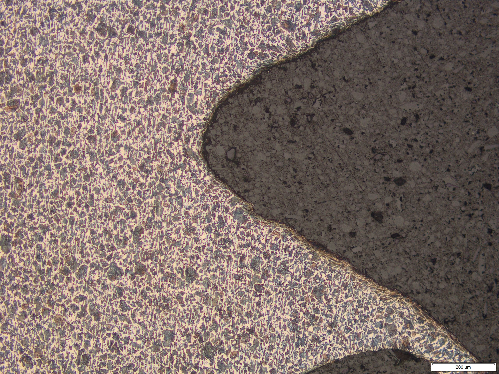

### C45

|  |  |
| -- | -- |
| Prüfgegenstand | Zugprobe, nach der Zugprüfung |
| Werkstoff | **C45+N** |
| Zustand | normalisiert |
| Oberfläche | poliert (ungeätzt)|
| Schliffposition | im Inneren im Bereich des Einspanngewindes |
| Gefügebestandteile | zeilige Anordnung nichtmetallischer Einschlüsse |
| Interpretation | Schlackezeile: Schlacke (nichtmetallische Begleitphasen, letztlich Verunreinigungen) aus dem Herstellungsprozesszeilige wird im Stahl eingeschlossen und längs der Walzrichtung (also parallel zur Walzrichtung) "eingewalzt" und damit in Walzrichutng ausgezogen (Anm.: welche Stahlsorte vorliegt ist in dem ungeätzten Schliff nicht zu erkennen) |
|  |  |

|  |  |
| -- | -- |
| Prüfgegenstand | Zugprobe, nach der Zugprüfung |
| Werkstoff | **C45+N** |
| Zustand | normalisiert |
| Oberfläche | poliert/geätzt 3%-alk. Salpetersäure |
| Schliffposition | im Inneren im Bereich des Einspanngewindes |
| Gefügebestandteile | Ferrit/ Perlit; deutlich zu erkennen eine Zeilige Anordnung des Gefüges |
| Interpretation | zeilige Ausbildung der Gefügebestandteile im innern durch das Normalisieren einer ursprünglich kaltverfestigten Werkstoffzustands entstanden |
|  |  |
| Schliffposition | wie vorheriges Bild nur bei stärkerer Vergrößerung und anderer Probenausrichtung|
| Gefügebestandteile | Ferrit/ Perlit; deutlich zu erkennen das "Streifenmuster" des Perlits |
|  |  |

|  |  |
| -- | -- |
| Prüfgegenstand | unbekannt |
| Werkstoff | **C45+N** |
| Zustand | geglüht (nicht näher spezifiziert) 
| Oberfläche | poliert/geätzt 3%-alk. Salpetersäure |
| Schliffposition | im Inneren |
| Gefügebestandteile | Ferrit/ Perlit, deutlich Bereiche mit geringerem Perlitanteil (rechts und links auf dem Bild) zu erkennen |
| Interpretation | geringerer Perlit ist auf die Entkohlung der seitlichen Breiche durch eine Glühbehandlung (z.B. zu lange Glühzeit beim Normalisieren, geziehltes entkohlendes Glühen) zurückzuführen |
|  |  |

|  |  |
| -- | -- |
| Prüfgegenstand | Zugprobe, nach der Zugprüfung |
| Werkstoff | **C45+N** |
| Zustand | normalisiert 
| Oberfläche | poliert/geätzt 3%-alk. Salpetersäure |
| Schliffposition | Randbereich, Gewindegrund des Einspanngewindes |
| Gefügebestandteile | unter der Oberfläche Ferrit/ Perlit , leichte zeilige Anordnung der Ferritkörner zu erkennen; Randbereich rd. 80µm breiter Ferritsaum mit grober, zum Rand gerichteter Kornstruktur |
| Interpretation | zeilige Ausbildung des Gefüges im innern, verm. durch durch das Normalisieren eines ursprünglich kaltverfestigten Werkstoffzustands entstanden; Randbereich aufgrund des Glühens verm. an Luft entkohlt, Kornorientierung aufgrund der Wärmeeinwirkung "von außen" tendentiell in Richtung der Oberfläche |
|  |  |

|  |  |
| -- | -- |
| Prüfgegenstand | Zugprobe, nach der Zugprüfung |
| Werkstoff | **C45+C** |
| Zustand | kaltverfestigter Anlieferungszustand (kaltgewalztes Vormaterial) |
| Oberfläche | poliert (ungeätzt)|
| Schliffposition | Oberflächennah, im Bereich des Einspanngewindes | |
| Gefügebestandteile | kleine gelichmäßig verteilte nichtmetallische Einschlüsse (Anm.: welche Stahlsorte vorliegt ist in dem ungeätzten Schliff nicht zu erkennen) |
|  |  |

|  |  |
| -- | -- |
| Prüfgegenstand | Zugprobe, nach der Zugprüfung |
| Werkstoff | **C45+C** |
| Zustand | kaltverfestigter Anlieferungszustand (kaltgewalztes Vormaterial) |
| Oberfläche | poliert/geätzt 3%-alk. Salpetersäure |
| Schliffposition | im Innern im Bereich des Einspanngewindes |
| Gefügebestandteile | Ferrit/ Perlit, größerer Perlitanteil; insb. an den Ferrit-Körnern (hell, weicher Gefügebestandteil) ist eine Längsstreckung / Orientierung zu erkennen |
| Interpretation | Normalisierte Grundzustand, Kornausrichtung duch den Kaltwalzprozess entstanden |
|  |  |

|  |  |
| -- | -- |
| Prüfgegenstand | Zugprobe, nach der Zugprüfung |
| Werkstoff | **C45+C** |
| Zustand | kaltverfestigter Anlieferungszustand (kaltgewalztes Vormaterial) |
| Oberfläche | poliert/geätzt 3%-alk. Salpetersäure |
| Schliffposition | Oberflächennah, im Bereich des geschnittenen Gewindes des Einspanngewindes |
| Gefügebestandteile | Ferrit/ Perlit; an der Oberfläche teilweise stark verformte Körner zu erkennen |
| Interpretation | deformierte Körner an der Oberfläche duch die plastische Verformung des Randbereichs beim Gewindeschneiden |
|  |  |

