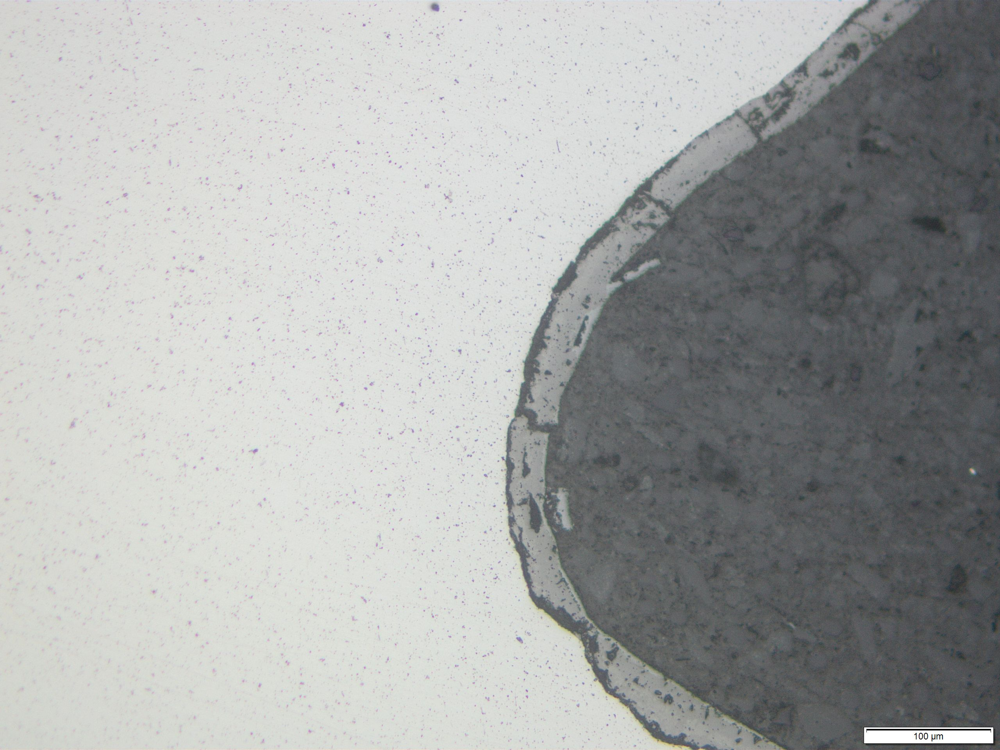
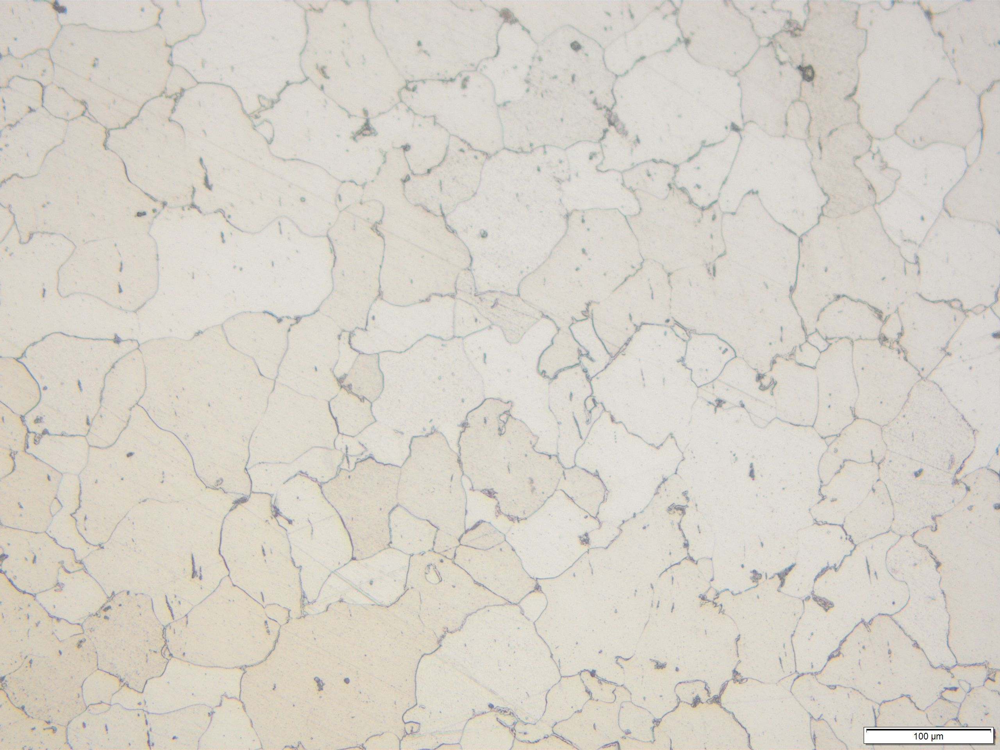
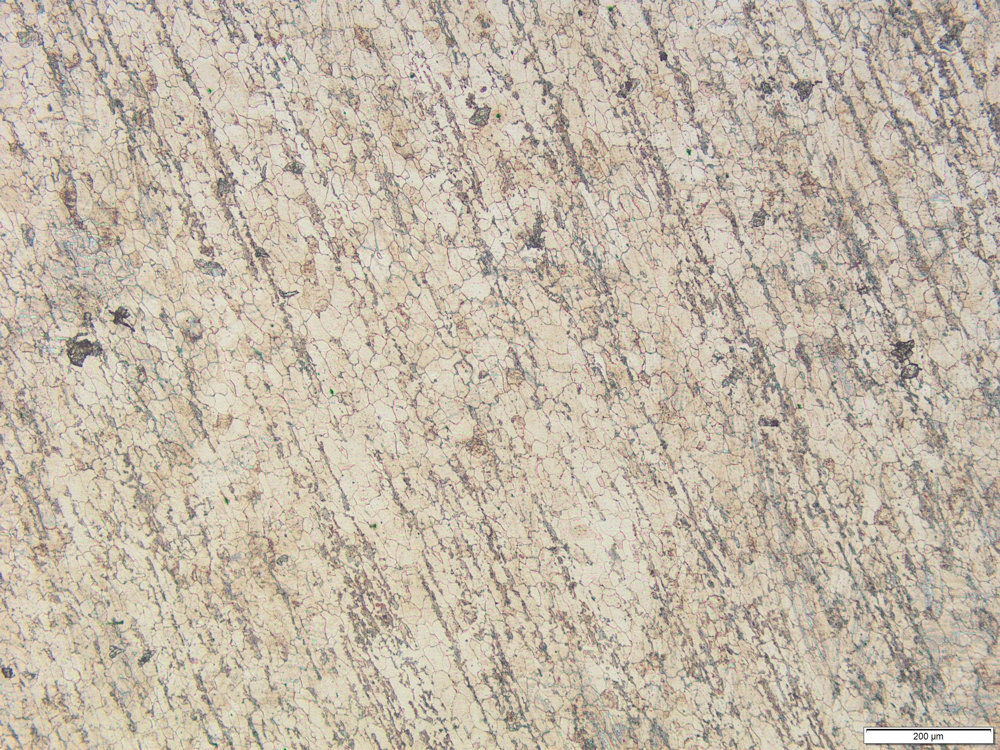
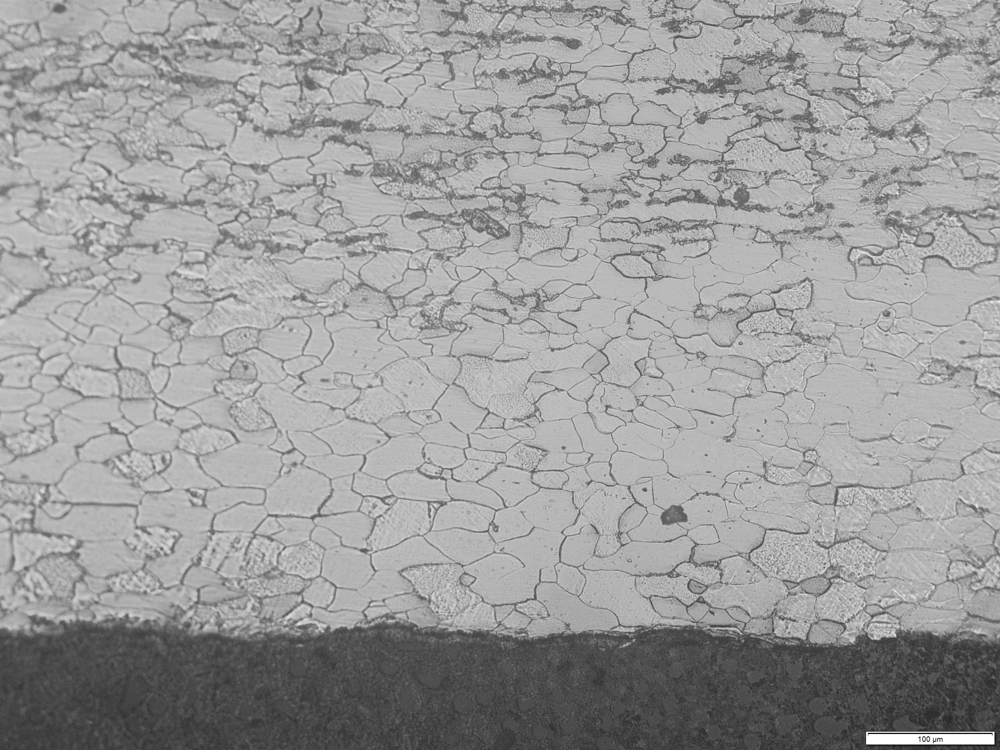
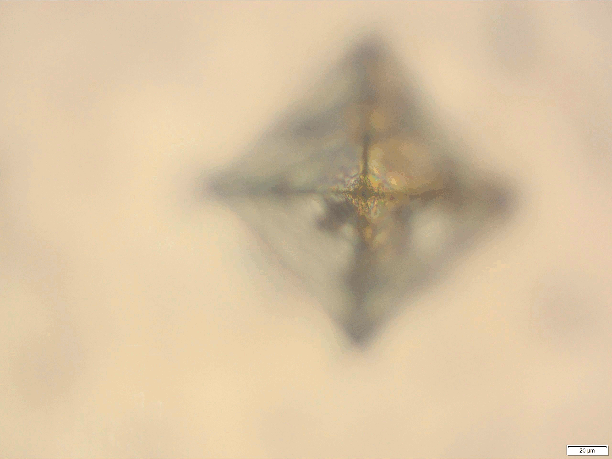
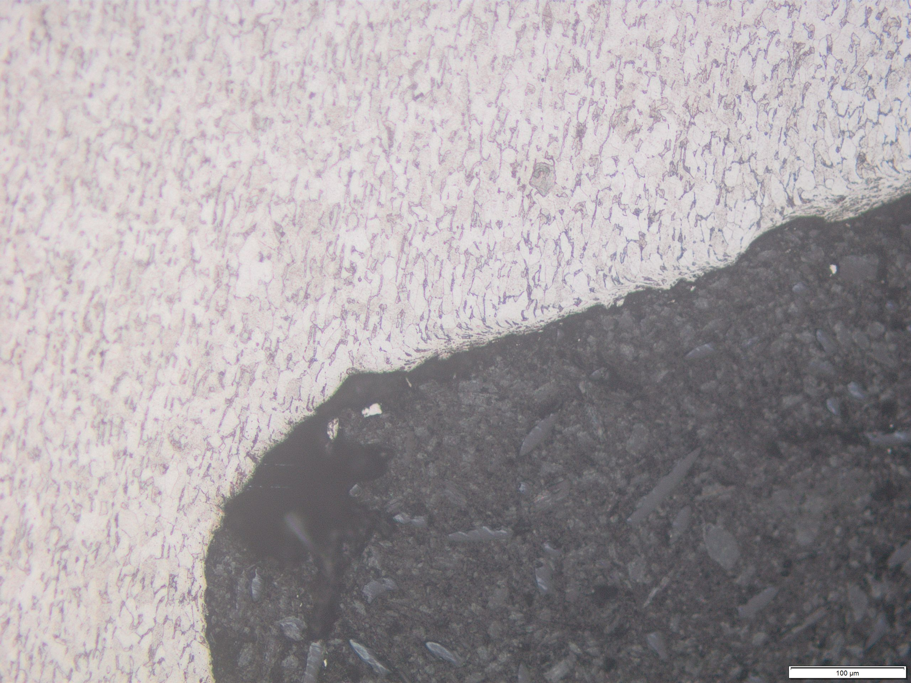
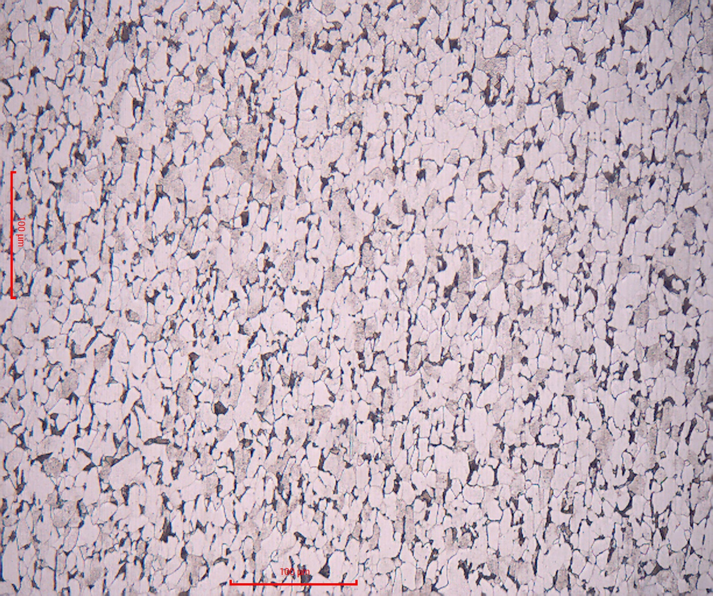

### S235

|  |  |
| -- | -- |
| Prüfgegenstand | Zugprobe, nach der Zugprüfung |
| Werkstoff | **S235JR+N** |
| Zustand | normalisiert 
| Oberfläche | poliert |
| Schliffposition | oberflächennah, Gewindegrund im Bereich des Einspanngewindes |
| Gefügebestandteile | kleine gelichmäßig verteilte nichtmetallische Einschlüsse; dünne Schicht an der Oberfläche|
| Interpretation | dünne Schicht kann eine durch eine Glühbenhandlung entstandene Oxidschicht an der Oberfläche sein, ohne weitere Untersuchungen (z.B. Mikrohärteprüfung, chem. Analyse) nicht zu bewerten (Anm.: welche Stahlsorte vorliegt ist in dem ungeätzten Schliff nicht zu erkennen)  |
|  |  |

|  |  |
| -- | -- |
| Prüfgegenstand | Zugprobe, nach der Zugprüfung |
| Werkstoff | **S235JR+N** |
| Zustand | normalisiert 
| Oberfläche | poliert/geätzt 3%-alk. Salpetersäure |
| Schliffposition | im Innern im Bereich des Einspanngewindes |
| Gefügebestandteile | fast rein ferritisches Gefüge, relativ große Körner |
| Interpretation | vermutlich entkohltes Gefüge (fehlender Perlit) aufgrund zu langer Glühbehandlung (mit daraus ebenfalls resultierendes Kornwachstum) |
|  |  |

|  |  |
| -- | -- |
| Prüfgegenstand | Zugprobe, nach der Zugprüfung |
| Werkstoff | **S235JR+N** |
| Zustand | normalisiert 
| Oberfläche | poliert/geätzt 3%-alk. Salpetersäure |
| Schliffposition | im Innern im Bereich des Einspanngewindes |
| Gefügebestandteile | ferritisches Gefüge ohne Kornorientierung mit zeilig angeordnetem Perlit  |
| Interpretation | zeilige Ausbildung der Gefügebestandteile ungewollt durch das Normalisieren eines ursprünglich kaltverfestigten Werkstoffzustands entstanden |
|  |  |

|  |  |
| -- | -- |
| Prüfgegenstand | Zugprobe, nach der Zugprüfung |
| Werkstoff | **S235JR+N** |
| Zustand | normalisiert 
| Oberfläche | poliert/geätzt 3%-alk. Salpetersäure |
| Schliffposition | Randbereich der zylinbdrischen Prüfstrecke der Zugprobe |
| Gefügebestandteile | fast rein ferristisches, grobkörniges Gefüge im oberflächennahen Randbereich; ab rd. 300µm unter der Kleinere Körner, zeilig angeordneter Perlit 
| Interpretation | Randbereich aufgrund einer Wärmebehandlung (glühen) verm. an Luft entkohlt, grobes Korn im Randbereich aufgrund der an der Oberfläche vorliegenden längeren Glühzeiten (Wärmeeintrag erfolgt über die Oberfläche); zeilige Ausbildung der Gefügebestandteile im innern durch das Normalisieren eines ursprünglich kaltverfestigten Werkstoffzustands entstanden |
|  |  |

|  |  |
| -- | -- |
| Prüfgegenstand | Zugprobe, nach der Zugprüfung |
| Werkstoff | **S235JR+C** |
| Zustand | kaltverfestigter Anlieferungszustand (kaltgewalztes Vormaterial) |  
| Oberfläche | poliert/geätzt 3%-alk. Salpetersäure |
| Schliffposition | im Innern im Bereich des Einspanngewindes, am Ort eines Vickershärteeindrucks; Aufnahmen mit unterschiedlicher Fokusebene animiert |
| Gefügebestandteile | ferritisch-perlitisches Gefüge; deutlich größerer Anteil des Ferrits  |
|  |  |

|  |  |
| -- | -- |
| Prüfgegenstand | Zugprobe, nach der Zugprüfung |
| Werkstoff | **S235JR+C** |
| Zustand | kaltverfestigter Anlieferungszustand (kaltgewalztes Vormaterial) |
| Oberfläche | poliert/geätzt 3%-alk. Salpetersäure |
| Schliffposition | Oberflächennah, Gewindegrund im Bereich des Einspanngewindes |
| Gefügebestandteile | ferritisch-perlitisches Gefüge; deutlich größerer Anteil des Ferrits; Körner im Innern gerichtet; an der oberfläche teilweise Verformte Körner zu erkennen |
| Interpretation | Gerichtete Körner aufgrund des kaltverfestigten Vormaterials (Walzrichung); deformierte Körner an der Oberfläche duch die plastische Verformung des Randbereichs beim Gewindeschneiden |
|  |  |

|  |  |
| -- | -- |
| Werkstoff | **S235+C** |
| Zustand | kaltverfestigter Anlieferungszustand (kaltgewalztes Vormaterial) |
| Oberfläche | poliert/geätzt 3%-alk. Salpetersäure |
| Schliffposition | im Innern im Bereich des Einspanngewindes |
| Gefügebestandteile | ferritisch-perlitisches Gefüge; deutlich größerer Anteil des Ferrits; Körner  gerichtet|
| Interpretation | normalisierter Grundzustand, Kornausrichtung duch den Kaltwalzprozess entstanden |
|  |  |