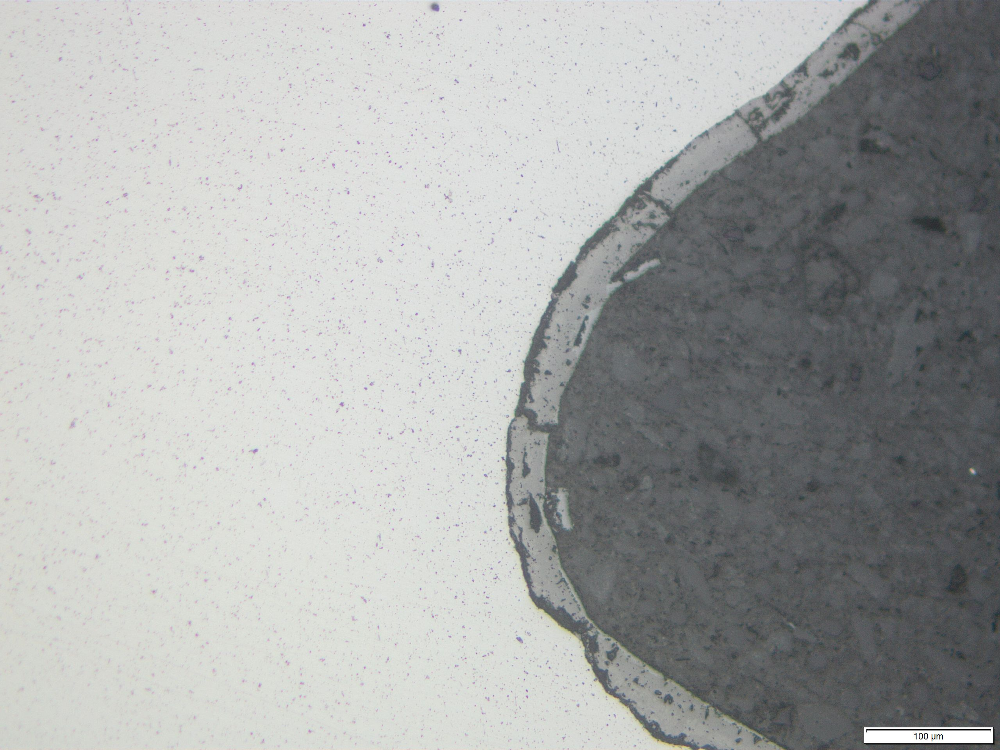

### S235

|  |  |
| -- | -- |
| Werkstoff | **S235+N** |
| Zustand | normalisiert 
| Oberfläche | poliert |
| Schliffposition | Oberflächennah, Gewindegrund | |
| Gefügebestandteile | kleine gelichmäßig verteilte nichtmetallische Einschlüsse; dünne Schicht an der Oberfläche (verm. Oxidschicht ander Oberfläche durch die Glühbehandelung) |
|  |  |

|  |  |
| -- | -- |
| Werkstoff | **S235+N** |
| Zustand | normalisiert 
| Oberfläche | poliert/geätzt 3%-alk. Salpetersäure |
| Schliffposition | im Innern |
| Gefügebestandteile | fast rein ferristisches Gefüge, relativ große Körner (Vermutlich durch zu lange Normalisierungsbehandlung: 1. Entkohlung (wenig Perlit), 2. Konrwachstum) |
|  |  |

|  |  |
| -- | -- |
| Werkstoff | **S235+C** |
| Zustand | normalisiert 
| Oberfläche | poliert/geätzt 3%-alk. Salpetersäure |
| Schliffposition | im Innern, am Ort eines Vickershärteeindrucks; Aufnahmen mit unterschiedlicher Fokusebene animiert |
| Gefügebestandteile | fast rein ferristisches Gefüge, relativ große Körner (Vermutlich durch zu lange Normalisierungsbehandlung: 1. Entkohlung (wenig Perlit), 2. Konrwachstum) |
|  |  |