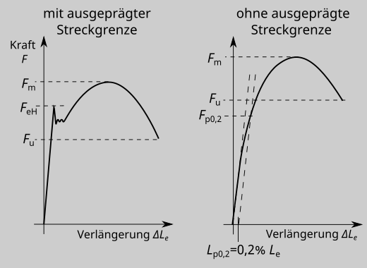
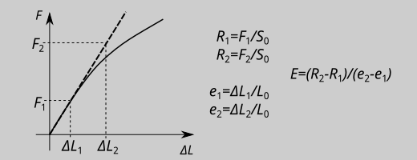

# Auswertung

## Kennwerte, Übersicht

| Kennwert |  Definiton |
| -------- | ------------------------- | 
| Anfangsquerschnittsfläche | $S_0=\pi d_0^2/4$ (Kreisquerschnitt)
| kleinster Querschnitt nach Bruch | $S_u=\pi d_u^2/4$ (Kreisquerschnitt)
| obere Streckgrenze | $R_{eH}=F_{eH}/S_0$ |
| 0,2%-Dehngrenze | $R_{p0,2}=F_{p0,2}/S_0$ |
| Zugfestigkeit | $R_{m}=F_{m}/S_0$ |
| Reissfestigkeit (nicht in der DIN EN ISO 6892-1 enthalten) | $R_u=F_u/S_u$ |
| Bruchdehnung | $A=(L_u-L_0)/L_0$ |
| Brucheinschnürung | $Z=(S_0-S_u)/S_0$ |
| E-Modul | $E=(R_2-R_1)/(e_2-e_1)=\Delta R / \Delta e \text{   } (=\Delta \sigma / \Delta \epsilon )$ |

## Erläuterungen
Die Messgrößen vor und nach der durchgefürhten Prüfung sind in der folgenden darstellung zusammengefasst. Dabei ist zu beachten, dass sich die (Bezugs-)Längen $L_e$ (Extensometermesslänge), $L_0$ (Anfangsmesslänge) und $L_c$ (Prüflänge) i. A. unterscheiden. 

Es ist darauf zu achten, bei der Berechnung der Dehnungen immer die richige Bezugslänge zu wählen:

- die Bruchdahnung $A$ ergibt sich aus der Änderung der Anfangsmesslänge $L_u-L_0$ bezogen auf die Anfangsmesslänge $L_0$
- der Extensometerweg für eine Dehung von $0,2%$ ergibt sich aus dieser Dehnung und der Messlänge des Extensometers $L_e$

Die Kraft und Verformungsgrößen ergeben für die Berechnung der Kennwerte ergeben sich aus der folgenden Darstellung: 

In dem Bild sind die beiden für metallische Werkstoffe typischen Ausprägungen des Kraft-verlängerungs-Verlaufs dargestellt: mit und ohne ausgeprägte Streckgrenze.  
Bei Werkstoffen mit ausgeprägter Streckgrenze ist der Bereich der elastischen und der elastisch-plastischen Verfomung deutich unterscheidbar. Ohne ausgeprägte Streckgrenze existiert ein allmählihcer übergang von der (linear) elastischen Verformung zur elastisch-plastischen. Um hier einen der Streckgrenze vergleichbaren Kennwert zu besitzen ist die Dehngrenze definiert, die typischer weise die den Spannungswert bei $0,2%$ beschreibt. Abzulesen ist der Wert durch die um die um den Dehnungswert von $0,2%$ verschobenen elastischen Geraden.

Der Elastizitätsmodul ist die Steigung der elastischen Geraden im Spannungs-Dehnungs-Diagramm (nicht im Kraft-Verformungs-Diagramm, daher sind hier wie in den folgenden Bild gezeigt zunächst die Spannungen und Dehnungen zu berechnen). Ermittelbar ist er über zwei beliebige Punkte auf der elstischen Geraden.

Die Reissfestigkeit ist eine nicht in der DIN EN ISO 6892-1 definierte Größe. Sie ist definiert als die Spannung, die kurz vor dem Bruch im kleinsten Querschnitt in der Einschnürung wirkt. Die so defineirte Festigkeitsgröße bezieht sich also auf den aktuellen Querscnitt und nicht wie die in der DIN EX ISO 6892-1 definierten Festikteitskennwerte auf den Ausgangsquerschnitt. 

## Beispiel

In der folgenden .pdf-Datei sind einige Beispiel der Auswertung des Zugversuchs enthalten. Es sit zu beachten, dass immer zwei Diagramme enthalten sind: Kraft-Traversenweg-Diagramm und Kraft-Extensometerweg-Diagramm. Wichtig ist, dass die Auswertugnen, in die die Dehnung eingehen (E-Modul, 0,2% Dehngrenze) immer in dem Extensometerweg-Diagramm durchgeführt werden.

[ZVBeispiel](220623_ZVVergleichswerte_mitProt-b.pdf)

## Dokumentation
